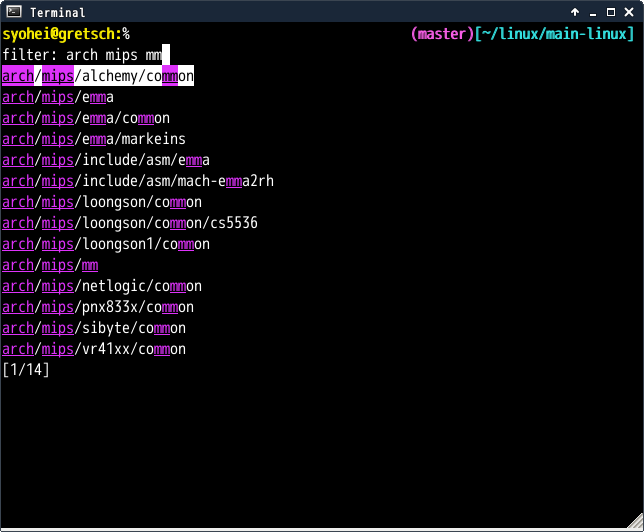

# zaw-git-directories

## Introduction

`zaw-git-directories` is a source of [zaw](https://github.com/zsh-users/zaw).
`zaw-git-directories` provides changing directory in git reposit with zaw style.


## Screenshot




## Requirements

* [zsh](http://www.zsh.org/)
* [zaw](https://github.com/zsh-users/zaw)


## Installation

Install `zaw-git-directories.zsh` to `zaw/sources` directory.


## Sample configuration

````sh
source ~/.zsh/zaw/zaw.zsh # If you install zaw to '~/.zsh/'
bindkey '^[#' zaw-git-directories # binding to 'Alt-@'
````
